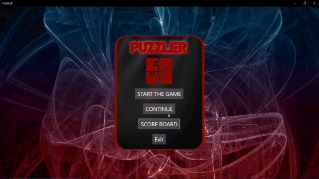

# Puzzler Game in Win Framework
 Puzzler Game Application (C#) with Visual Studio

Description:
A colourful Puzzler App, developed with the C# Framework library.  The blocks are slid until the numbers are ascending in order on the board to win.  The objective is to complete the puzzler as fast as possible to appear on the Leaderboard.

Elements:
VS C# Framework Development, Game pausing capabilities, multi-screen switching, time and score tracking.

 
